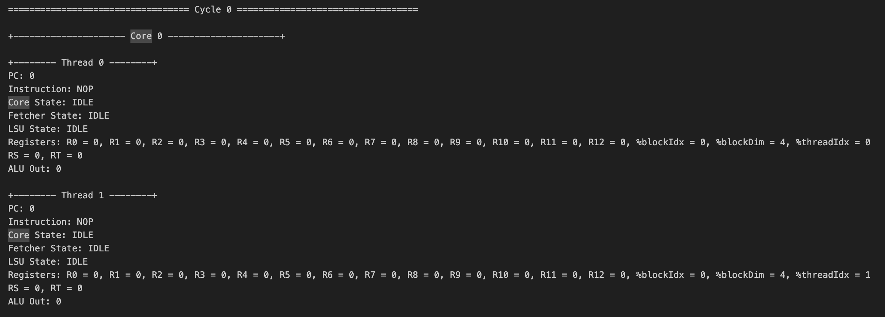

# tiny-gpu

A minimal GPU implementation in Verilog optimized for learning about how GPUs work from the ground up.

Built with <15 files of fully documented Verilog, complete documentation on architecture & ISA, working matrix addition/multiplication kernels, and full support for kernel simulation & execution traces.

### Table of Contents

- [Overview](#overview)
- [Architecture](#architecture)
  - [GPU](#gpu)
  - [Memory](#memory)
  - [Core](#core)
- [ISA](#isa)
- [Execution](#execution)
  - [Core](#core-1)
  - [Thread](#thread)
- [Kernels](#kernels)
  - [Matrix Addition](#matrix-addition)
  - [Matrix Multiplication](/tree/master?tab=readme-ov-file#matrix-multiplication)
- [Simulation](#simulation)
- [Advanced Functionality](#advanced-functionality)
- [Next Steps](#next-steps)

# Overview

If you want to learn how a CPU works all the way from architecture to control signals, there are many resources online to help you.

GPUs are not the same.

Because the GPU market is so competitive, low-level technical details for all modern architectures remain proprietary.

While there are lots of resources to learn about GPU programming, there's almost nothing available to learn about how GPU's work at a hardware level.

The best option is to go through open-source GPU implementations like [Miaow](https://github.com/VerticalResearchGroup/miaow) and [VeriGPU](https://github.com/hughperkins/VeriGPU/tree/main) and try to figure out what's going on. This is challenging since these projects aim at being feature complete and functional, so they're quite complex.

This is why I built `tiny-gpu`!

## What is tiny-gpu?

> [!IMPORTANT]
>
> **tiny-gpu** is a minimal GPU implementation optimized for learning about how GPUs work from the ground up.
>
> Specifically, with the trend toward general-purpose GPUs (GPGPUs) and ML-accelerators like Google's TPU, tiny-gpu focuses on highlighting the general principles of all of these architectures, rather than on the details of graphics-specific hardware.

With this motivation in mind, we can simplify GPUs by cutting out the majority of complexity involved with building a production-grade graphics card, and focus on the core elements that are critical to all of these modern hardware accelerators.

This project is primarily focused on exploring:

1. **Architecture** - What does the architecture of a GPU look like? What are the most important elements?
2. **Parallelization** - How is the SIMD progamming model implemented in hardware?
3. **Memory** - How does a GPU work around the constraints of limited memory bandwidth?

After understanding the fundamentals laid out in this project, you can checkout the [advanced functionality section](#advanced-functionality) to understand some of the most important optimizations made in production grade GPUs (that are more challenging to implement) which improve performance.

# Architecture

<p float="left">
  
  
</p>

## GPU

tiny-gpu is built to execute a single kernel at a time.

In order to launch a kernel, we need to do the following:

1. Load global program memory with the kernel code
2. Load data memory with the necessary data
3. Specify the number of threads to launch in the device control register
4. Launch the kernel by setting the start signal to high.

The GPU itself consists of the following units:

1. Device control register
2. Dispatcher
3. Variable number of compute cores
4. Memory controllers for data memory & program memory
5. Cache

### Device Control Register

The device control register usually stores metadata specifying how kernels should be executed on the GPU.

In this case, the device control register just stores the `thread_count` - the total number of threads to launch for the active kernel.

### Dispatcher

Once a kernel is launched, the dispatcher is the unit that actually manages the distribution of threads to different compute cores.

The dispatcher organizes threads into groups that can be executed in parallel on a single core called **blocks** and sends these blocks off to be processed by available cores.

Once all blocks have been processed, the dispatcher reports back that the kernel execution is done.

## Memory

The GPU is built to interface with an external global memory. Here, data memory and program memory are separated out for simplicity.

### Global Memory

tiny-gpu data memory has the following specifications:

- 8 bit addressability (256 total rows of data memory)
- 8 bit data (stores values of <256 for each row)

tiny-gpu program memory has the following specifications:

- 8 bit addressability (256 rows of program memory)
- 16 bit data (each instruction is 16 bits as specified by the ISA)

### Memory Controllers

Global memory has fixed read/write bandwidth, but there may be far more incoming requests across all cores to access data from memory than the external memory is actually able to handle.

The memory controllers keep track of all the outgoing requests to memory from the compute cores, throttle requests based on actual external memory bandwidth, and relay responses from external memory back to the proper resources.

Each memory controller has a fixed number of channels based on the bandwidth of global memory.

### Cache (WIP)

The same data is often requested from global memory by multiple cores. Constantly access global memory repeatedly is expensive, and since the data has already been fetched once, it would be more efficient to store it on device in SRAM to be retrieved much quicker on later requests.

This is exactly what the cache is used for. Data retrieved from external memory is stored in cache and can be retrieved from there on later requests, freeing up memory bandwidth to be used for new data.

## Core

Each core has a number of compute resources, often built around a certain number of threads it can support. In order to maximize parallelization, these resources need to be managed optimally to maximize resource utilization.

In this simplified GPU, each core processed one **block** at a time, and for each thread in a block, the core has a dedicated ALU, LSU, PC, and register file. Managing the execution of thread instructions on these resources is one of the most challening problems in GPUs.

### Scheduler

Each core has a single scheduler that manages the execution of threads.

The tiny-gpu scheduler executes instructions for a single block to completion before picking up a new block, and it executes instructions for all threads in-sync and sequentially.

In more advanced schedulers, techniques like **pipelining** are used to stream the execution of multiple instructions subsequent instructions to maximize resource utilization before previous instructions are fully complete. Additionally, **warp scheduling** can be use to execute multiple batches of threads within a block in parallel.

The main constraint the scheduler has to work around is the latency associated with loading & storing data from global memory. While most instructions can be executed synchronously, these load-store operations are asynchronous, meaning the rest of the instruction execution has to be built around these long wait times.

### Fetcher

Asynchronously fetches the instruction at the current program counter from program memory (most should actually be fetching from cache after a single block is executed).

### Decoder

Decodes the fetched instruction into control signals for thread execution.

### Register Files

Each thread has it's own dedicated set of register files. The register files hold the data that each thread is performing computations on, which enables the same-instruction multiple-data (SIMD) pattern.

Importantly, each register file contains a few read-only registers holding data about the current block & thread being executed locally, enabling kernels to be executed with different data based on the local thread id.

### ALUs

Dedicated arithmetic-logic unit for each thread to perform computations. Handles the `ADD`, `SUB`, `MUL`, `DIV` arithmetic instructions.

Also handles the `CMP` comparison instruction which actually outputs whether the result of the difference between two registers is negative, zero or positive - and stores the result in the `NZP` register in the PC unit.

### LSUs

Dedicated load-store unit for each thread to access global data memory.

Handles the `LDR` & `STR` instructions - and handles async wait times for memory requests to be processed and relayed by the memory controller.

### PCs

Dedicated program-counter for each unit to determine the next instructions to execute on each thread.

By default, the PC increments by 1 after every instruction.

With the `BRnzp` instruction, the NZP register checks to see if the NZP register (set by a previous `CMP` instruction) matches some case - and if it does, it will branch to a specific line of program memory. _This is how loops and conditionals are implemented._

Since threads are processed in parallel, tiny-gpu assumes that all threads "converge" to the same program counter after each instruction - which is a naive assumption for the sake of simplicity.

In real GPUs, individual threads can branch to different PCs, causing **branch divergence** where a group of threads threads initially being processed together has to split out into separate execution.

# ISA


tiny-gpu implements a simple 11 instruction ISA built to enable simple kernels for proof-of-concept like matrix addition & matrix multiplication (implementation further down on this page).

For these purposes, it supports the following instructions:

- `BRnzp` - Branch instruction to jump to another line of program memory if the NZP register matches the `nzp` condition in the instruction.
- `CMP` - Compare the value of two registers and store the result in the NZP register to use for a later `BRnzp` instruction.
- `ADD`, `SUB`, `MUL`, `DIV` - Basic arithmetic operations to enable tensor math.
- `LDR` - Load data from global memory.
- `STR` - Store data into global memory.
- `CONST` - Load a constant value into a register.
- `RET` - Signal that the current thread has reached the end of execution.

Each register is specified by 4 bits, meaning that there are 16 total registers. The first 13 register `R0` - `R12` are free registers that support read/write. The last 3 registers are special read-only registers used to supply the `%blockIdx`, `%blockDim`, and `%threadIdx` critical to SIMD.

# Execution

### Core

Each core follows the following control flow going through different stages to execute each instruction:

1. `FETCH` - Fetch the next instruction at current program counter from program memory.
2. `DECODE` - Decode the instruction into control signals.
3. `REQUEST` - Request data from global memory if necessary (if `LDR` or `STR` instruction).
4. `WAIT` - Wait for data from global memory if applicable.
5. `EXECUTE` - Execute any computations on data.
6. `UPDATE` - Update register files and NZP register.

The control flow is laid out like this for the sake of simplicity and understandability.

In practice, several of these steps could be compressed to be optimize processing times, and the GPU could also use **pipelining** to stream and coordinate the execution of many instructions on a cores resources without waiting for previous instructions to finish.

### Thread


Each thread within each core follows the above execution path to perform computations on the data in it's dedicated register file.

This resembles a standard CPU diagram, and is quite similar in functionality as well. The main difference is that the `%blockIdx`, `%blockDim`, and `%threadIdx` values lie in the read-only registers for each thread, enabling SIMD functionality.

# Kernels

I wrote a matrix addition and matrix multiplication kernel using my ISA as a proof of concept to demonstrate SIMD programming and execution with my GPU. The test files in this repository are capable of fully simulating the execution of these kernels on the GPU, producing data memory states and a complete execution trace.

### Matrix Addition

This matrix addition kernel adds two 1 x 8 matrices by performing 8 element wise additions in separate threads.

This demonstration makes use of the `%blockIdx`, `%blockDim`, and `%threadIdx` registers to show SIMD programming on this GPU. It also uses the `LDR` and `STR` instructions which require async memory management.

`matadd.asm`

```asm
.threads 8
.data 0 1 2 3 4 5 6 7          ; matrix A (1 x 8)
.data 0 1 2 3 4 5 6 7          ; matrix B (1 x 8)

MUL R0, %blockIdx, %blockDim
ADD R0, R0, %threadIdx         ; i = blockIdx * blockDim + threadIdx

CONST R1, #0                   ; baseA (matrix A base address)
CONST R2, #8                   ; baseB (matrix B base address)
CONST R3, #16                  ; baseC (matrix C base address)

ADD R4, R1, R0                 ; addr(A[i]) = baseA + i
LDR R4, R4                     ; load A[i] from global memory

ADD R5, R2, R0                 ; addr(B[i]) = baseB + i
LDR R5, R5                     ; load B[i] from global memory

ADD R6, R4, R5                 ; C[i] = A[i] + B[i]

ADD R7, R3, R0                 ; addr(C[i]) = baseC + i
STR R7, R6                     ; store C[i] in global memory

RET                            ; end of kernel
```

### Matrix Multiplication

The matrix multiplication kernel multiplies two 2x2 matrices. It performs element wise calculation of the dot product of the relevant row and column and uses the `CMP` and `BRnzp` instructions to demonstrate branching within the threads (notably, all branches converge so this kernel works on the current tiny-gpu implementation).

`matmul.asm`

```asm
.threads 4
.data 1 2 3 4                  ; matrix A (2 x 2)
.data 1 2 3 4                  ; matrix B (2 x 2)

MUL R0, %blockIdx, %blockDim
ADD R0, R0, %threadIdx         ; i = blockIdx * blockDim + threadIdx

CONST R1, #1                   ; increment
CONST R2, #2                   ; N (matrix inner dimension)
CONST R3, #0                   ; baseA (matrix A base address)
CONST R4, #4                   ; baseB (matrix B base address)
CONST R5, #8                   ; baseC (matrix C base address)

DIV R6, R0, R2                 ; row = i // N
MUL R7, R6, R2
SUB R7, R0, R7                 ; col = i % N

CONST R8, #0                   ; acc = 0
CONST R9, #0                   ; k = 0

LOOP:
  MUL R10, R6, R2
  ADD R10, R10, R9
  ADD R10, R10, R3             ; addr(A[i]) = row * N + k + baseA
  LDR R10, R10                 ; load A[i] from global memory

  MUL R11, R9, R2
  ADD R11, R11, R7
  ADD R11, R11, R4             ; addr(B[i]) = k * N + col + baseB
  LDR R11, R11                 ; load B[i] from global memory

  MUL R12, R10, R11
  ADD R8, R8, R12              ; acc = acc + A[i] * B[i]

  ADD R9, R9, R1               ; increment k

  CMP R9, R2
  BRn LOOP                    ; loop while k < N

ADD R9, R5, R0                 ; addr(C[i]) = baseC + i
STR R9, R8                     ; store C[i] in global memory

RET                            ; end of kernel
```

# Simulation

tiny-gpu is setup to simulate the execution of both of the above kernels. Before simulating, you'll need to install [iverilog](https://steveicarus.github.io/iverilog/usage/installation.html) and [cocotb](https://docs.cocotb.org/en/stable/install.html):

- Install Verilog compilers with `brew install icarus-verilog` and `pip3 install cocotb`
- Download the latest version of sv2v from https://github.com/zachjs/sv2v/releases, unzip it and put the binary in $PATH.
- Run `mkdir build` in the root directory of this repository.

Once you've installed the pre-requisites, you can run the kernel simulations with `make test_matadd` and `make test_matmul`.

Executing the simulations will output a log file in `test/logs` with the initial data memory state, complete execution trace of the kernel, and final data memory state.

If you look at the initial data memory state logged at the start of the logfile for each, you should see the two start matrices for the calculation, and in the final data memory at the end of the file you should also see the resultant matrix.

Below is a sample of the execution traces, showing on each cycle the execution of every thread within every core, including the current instruction, PC, register values, states, etc.



**For anyone trying to run the simulation or play with this repo, please feel free to DM me on [twitter](https://twitter.com/majmudaradam) if you run into any issues - I want you to get this running!**

# Advanced Functionality

For the sake of simplicity, there were many additional features implemented in modern GPUs that heavily improve performance & functionality that tiny-gpu omits. We'll discuss some of those most critical features in this section.

### Multi-layered Cache & Shared Memory

In modern GPUs, multiple different levels of caches are used to minimize the amount of data that needs to get accessed from global memory. tiny-gpu implements only one cache layer between individual compute units requesting memory and the memory controllers which stores recent cached data.

Implementing multi-layered caches allows frequently accessed data to be cached more locally to where it's being used (with some caches within individual compute cores), minimizing load times for this data.

Different caching algorithms are used to maximize cache-hits - this is a critical dimension that can be improved on to optimize memory access.

Additionally, GPUs often use **shared memory** for threads within the same block to access a single memory space that can be used to share results with other threads.

### Memory Coalescing

Another critical memory optimization used by GPUs is **memory coalescing.** Multiple threads running in parallel often need to access sequential addresses in memory (for example, a group of threads accessing neighboring elements in a matrix) - but each of these memory requests is put in separately.

Memory coalescing is used to analyzing queued memory requests and combine neighboring requests into a single transaction, minimizing time spent on addressing, and making all the requests together.

### Pipelining

In the control flow for tiny-gpu, cores wait for one instruction to be executed on a group of threads before starting execution of the next instruction.

Modern GPUs use **pipelining** to stream execution of multiple sequential instructions at once while ensuring that instructions with dependencies on each other still get executed sequentially.

This helps to maximize resource utilization within cores as resources are not sitting idle while waiting (ex: during async memory requests).

### Warp Scheduling

Another strategy used to maximize resource utilization on course is **warp scheduling.** This approach involves breaking up blocks into individual batches of theads that can be executed together.

Multiple warps can be executed on a single core simultaneously by executing instructions from one warp while another warp is waiting. This is similar to pipelining, but dealing with instructions from different threads.

### Branch Divergence

tiny-gpu assumes that all threads in a single batch end up on the same PC after each instruction, meaning that threads can be executed in parallel for their entire lifetime.

In reality, individual threads could diverge from each other and branch to different lines based on their data. With different PCs, these threads would need to split into separate lines of execution, which requires managing diverging threads & paying attention to when threads converge again.

### Synchronization & Barriers

Another core functionality of modern GPUs is the ability to set **barriers** so that groups of threads in a block can synchronize and wait until all other threads in the same block have gotten to a certain point before continuing execution.

This is useful for cases where threads need to exchange shared data with each other so they can ensure that the data has been fully processed.

# Next Steps

Updates I want to make in the future to improve the design, anyone else is welcome to contribute as well:

- [ ] Add a simple cache for instructions
- [ ] Build an adapter to use GPU with Tiny Tapeout 7
- [ ] Add basic branch divergence
- [ ] Add basic memory coalescing
- [ ] Add basic pipelining
- [ ] Optimize control flow and use of registers to improve cycle time
- [ ] Write a basic graphics kernel or add simple graphics hardware to demonstrate graphics functionality

**For anyone curious to play around or make a contribution, feel free to put up a PR with any improvements you'd like to add 😄**
